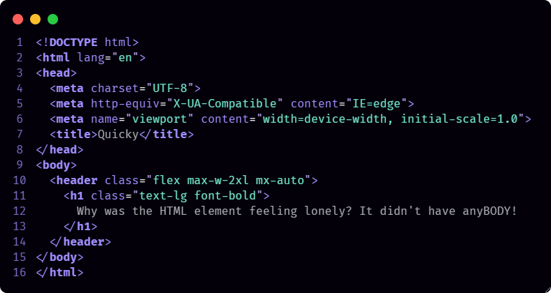
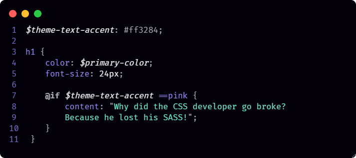
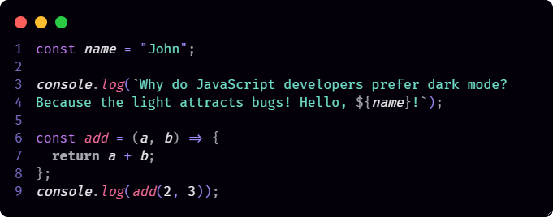
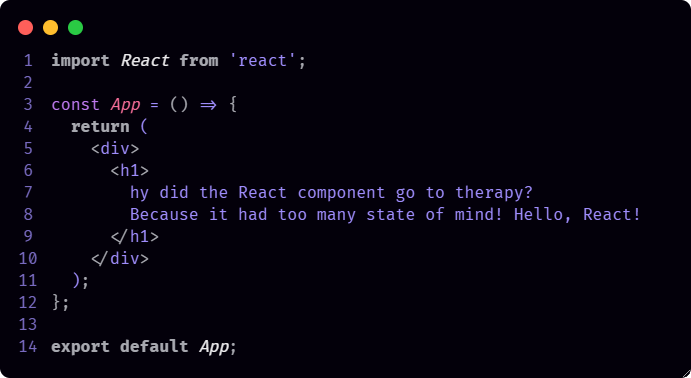
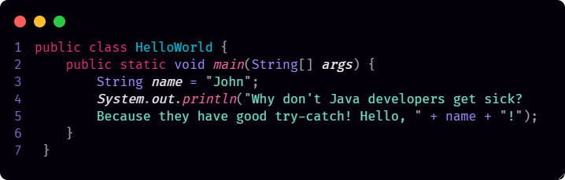
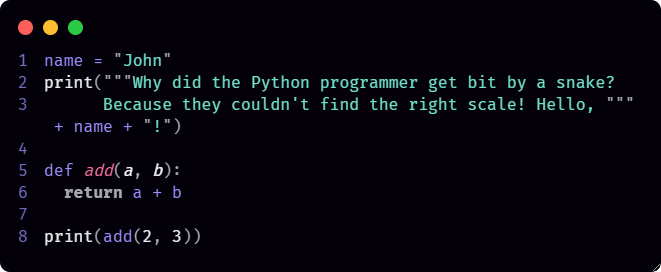
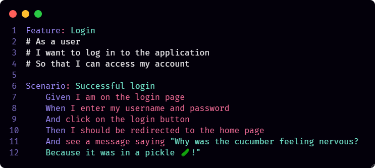

  

  

# Quicky Dark Theme 🐇

Here is the VS Code theme that match our color palette. Here at *Quicky* we like dark themes, so it's dark.

💡 We took inspiration from the [Coder Coder Dark](https://marketplace.visualstudio.com/items?itemName=CoderCoder.codercoder-dark-theme) theme as well as the [Shades of Purple](https://marketplace.visualstudio.com/items?itemName=ahmadawais.shades-of-purple) suite.

💥 If you like this theme you may considere [buy us some coffees ☕](https://www.buymeacoffee.com/renerpires)!

## Screenshots

### HTML

### SASS

### JavaScript

### React

### Java

### Python

### Gherkin

